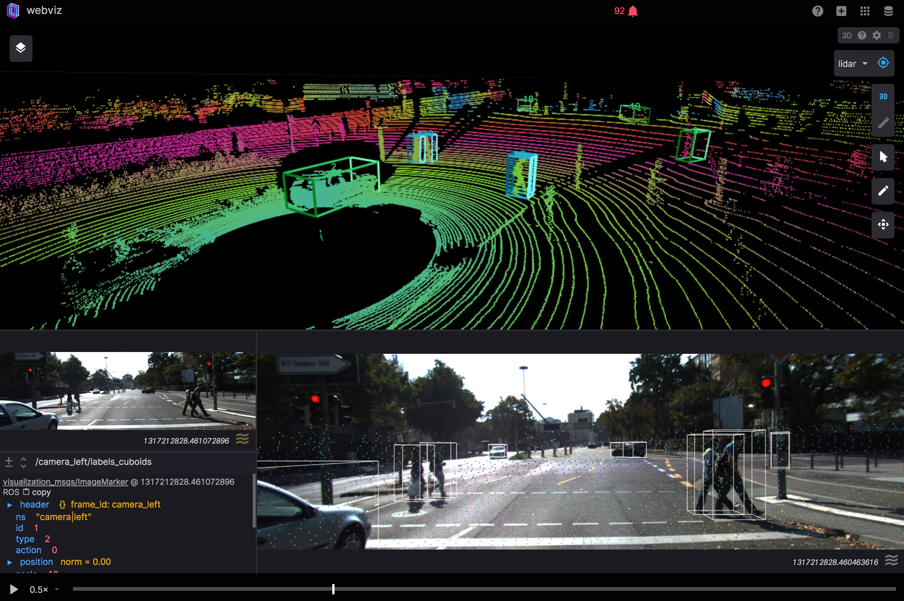

# PSegs KITTI Extension: ROS Bags

This project contains [ROS Bags](http://wiki.ros.org/Bags) derived
from [KITTI](http://www.cvlibs.net/datasets/kitti/) Tracking 
Benchmark data.  The files are a demo of the 
[PSegs ROS Extension](https://github.com/pwais/psegs-ros-ext) and 
were generated using `psegs-ros-util`.  These files are released under
the same license as KITTI.

Try playing one of the bags in [Webviz](https://webviz.io/). Click for video:

